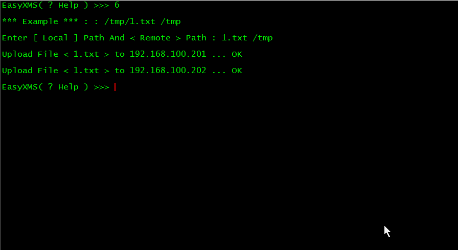

EasyXMS
=======

    	EasyXMS是一个用于批量管理Linux/Unix服务器的简易系统，如：多线程批量执行命令、多线程批量上传文件等功能.

### 有什么优势？

        1.简单易用
        2.轻量级,只需要一个脚本文件,不需要安装Client端
        3.安装部署快,一键安装所需的环境

 

一.主要功能
-----------
 

		1.批量执行命令
		2.批量上传文件
		3.记录每次输入的命令到文件
		4.记录每次执行命令的结果到文件
 

二.运行环境
-----------
 

		1.Python2.7
			下载地址：http://www.python.org

		2.easy_install 工具（是Python安装模块的一个工具，像yum，可以自动解决依赖）
			下载地址： http://peak.telecommunity.com/dist/ez_setup.py

		3.PyCrypto 2.1+ 模块（PyCrypto是使用Python编写的加密工具包）
			下载地址：https://www.dlitz.net/software/pycrypto/

		4.paramiko 模块（是用Python编写的支持SSH协议的模块）
			使用easy_install 进行安装
 

三.环境安装
-----------
 
[点击查看依赖软件包安装过程](http://linux5588.blog.51cto.com/65280/1275180)  

    也可以使用项目中的  one_key_install_paramiko.sh  Shell脚本一键安装环境
    请使用  source 脚本名  的方式来执行脚本
 

四.运行过程中产生的文件
--------------------
 
在脚本的执行过程中，默认是会在当前目录下生成以下文件

		1.server.conf
			该文件是用于存储各个服务器的连接信息如 IP地址:端口:用户名:密码，存储的信息是经过简单的加密,当然使用的可逆的加密算法.
            如下所示每行代表一个IP信息：
			MTkyLjE2OC4xMDAuMjAxOjIyOnJvb3Q6MTIzNDU2
			MTkyLjE2OC4xMDAuMjAyOjIyOnJvb3Q6MTIzNDU2

		2.paramiko.log
			该文件是paramiko模块在运行过程中产生的日志文件

		3.command_history.log
			该文件是记录执行过的命令

		4.command_result_history.log
			该文件是记录执行过的命令的结果
 

五.怎么执行脚本？
-----------------
 
1.使用 python 脚本名 方式来执行(推荐使用这种方式)

		python EasyXMS.py

2.使用 脚本的路径来执行，注意加上可执行权限

     	./EasyXMS.py
         
 

六.操作演示
-----------
 

### 1.主菜单

输入？ 即可获得主菜单帮助

 

        0 增加服务器的IP信息到配置文件（server.conf 以下都指的是该配置文件）
        1 加载一个包含多个服务器IP信息的文件，用于批量添加服务器到
        2 列出当前配置文件中存在的服务器
        3 从配置文件中删除指定的服务器信息
        4 清空配置文件
        5 批量执行命令
        6 批量上传文件
        7 清屏

### 2.选项 0 增加服务器的IP信息到配置文件

 

### 3.选项1 加载一个包含多个服务器IP信息的文件 
准备一个文本文件，里面的包含这些内容 IP地址:端口（22端口可以不写）:用户名:密码 每行一个 例如： 

        192.168.100.204:root:123456
        192.168.100.205:root:123
        192.168.100.206:root:123

 

### 4.选项 2  列出当前配置文件中存在的服务器 

 

### 5.选项 3 从配置文件中删除指定的服务器信息

 

### 6.选项 4 清空配置文件

 

### 7.选项 5 批量执行命令

 

### 8.选项 6 批量上传文件

 

### 9.选项 7 清屏

 